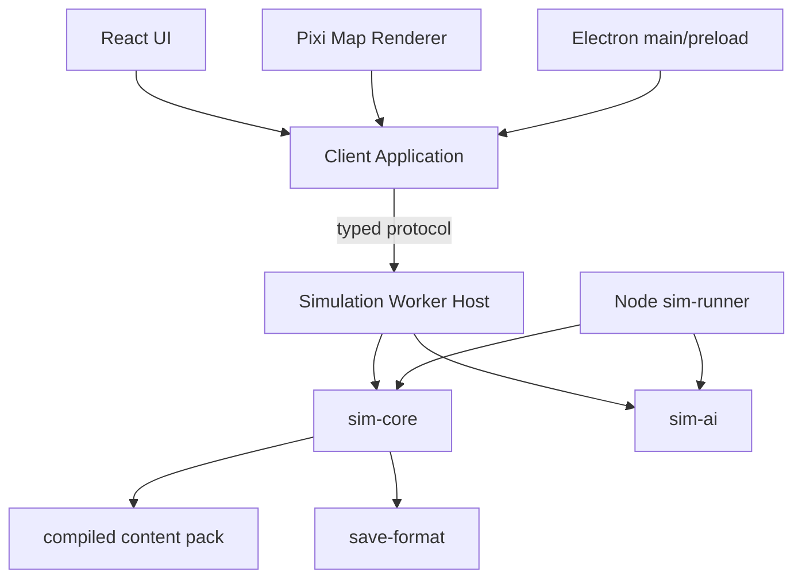

# 02. 游戏程序设计文档

**状态：FROZEN 架构 + TARGET 性能预算**

## 1. 运行形态

同一规则代码支持三种宿主：

```text
Web App
  React + PixiJS + Simulation Web Worker

Electron App
  Electron main/preload + 同一 Web renderer + Simulation Web Worker

Node Sim Runner
  无 UI，直接调用 sim-core，批量跑局/平衡/回放检查
```

不得维护浏览器版和桌面版两套规则。

## 2. 功能分层



### 领域核心

负责世界状态、规则、时间、命令校验、事件、随机数和确定性。不知道 DOM、Canvas、文件路径、窗口或 Steam。

### 应用层

负责编排启动、暂停、读档、查询、命令提交、Read Model 和平台 adapter。不实现领域公式。

### 表现层

React 显示信息，Pixi 显示地图，音频/动画解释已提交结果。表现失败不得改变模拟结果。

### 基础设施层

浏览器存储、Electron 文件、日志、遥测、压缩、平台 API 的 adapter。

## 3. 仓库结构目标

```text
/apps
  /web
  /desktop
  /sim-runner
  /content-tools
  /storybook
/packages
  /sim-core
  /sim-ai
  /sim-testkit
  /protocol
  /content-schema
  /content-runtime
  /save-format
  /client-core
  /map-renderer
  /ui
  /platform-browser
  /platform-electron
/content-source
/docs
/tests
```

依赖必须形成有向无环图。`sim-core` 位于最底层，禁止反向依赖。

## 4. 世界状态

### 定义与状态分离

不可变定义：

```text
PersonDefinition, PolityDefinition, SettlementDefinition,
DistrictDefinition, RouteDefinition, TraitDefinition,
PolicyDefinition, EventDefinition, ScenarioDefinition
```

可变状态：

```text
PersonState, PolityState, DistrictState, SettlementState,
ArmyState, RelationState, ObligationState, SiegeState,
FactionKnowledgeState, ProposalState
```

定义在内容编译时分配稳定 ID。运行时不通过字符串名称查找核心实体。

### 数据布局

首版优先可读的稠密数组和 typed records，不使用复杂 ECS：

```ts
interface WorldState {
  readonly meta: WorldMeta;
  readonly persons: PersonStateTable;
  readonly polities: PolityStateTable;
  readonly districts: DistrictStateTable;
  readonly armies: ArmyStatePool;
  readonly relations: RelationStore;
  readonly schedulers: SchedulerState;
}
```

大型集合使用稳定数值 ID，关系使用 ID 或专用边表。禁止深层循环对象图。

## 5. 时间调度

### 固定每日阶段

阶段顺序是规则的一部分，必须版本化并测试：

1. 应用已确认命令。
2. 行军与交通容量。
3. 补给、消耗、疾病与逃亡。
4. 会战与围城结算。
5. 地方建设、调略和征发进度。
6. 情报传播与过期。
7. 事件触发。
8. 不变量检查（开发/测试构建）。
9. 生成 Commit、ReadModelDelta 与 RenderDelta。

月度、季度和年度系统在特定日被调度，不在每帧全量扫描。

### 暂停与速度

UI 发送速度意图；Worker 决定一次处理多少完整逻辑日。不得向 UI 暴露半日、半阶段状态。

## 6. Command / Event / Query

### Command

所有世界修改由版本化 discriminated union 表达：

```ts
type GameCommand =
  | AppointOfficeCommand
  | SetDistrictPolicyCommand
  | SetDistrictPolicyBatchCommand
  | NegotiateObligationCommand
  | PrepareCampaignCommand
  | MobilizeArmyCommand
  | MoveArmyCommand
  | ResolveSiegeDecisionCommand
  | GrantRewardCommand;
```

每个命令包含：`commandId`、`issuedBy`、`issuedAtDay`、payload 和 schema version。

### 校验

分两阶段：

- `previewCommand`：返回预计代价、受影响对象和不可执行原因，不改状态。
- `applyCommand`：在提交时重新验证，原子应用或完整拒绝。

批量命令必须定义部分失败语义，默认 `ApplyEligibleOnly` 需明确回报每个失败项。

### Domain Event

事件描述重要语义，不记录每个低价值数值变化：

```text
OfficeAppointed
CampaignPreparationStarted
ArmyDeparted
SupplyRouteBroken
VassalDefaulted
CastleSurrendered
RulerDied
SuccessionResolved
```

### Query / Read Model

UI 不直接遍历 WorldState。Worker/Client Core 提供面向页面的查询：

```text
OfficerAssignmentReadModel
CampaignPlannerReadModel
VassalNetworkReadModel
DistrictTableReadModel
MapOverviewReadModel
```

高频地图更新使用最小 RenderDelta。

## 7. Worker 协议

使用显式类型和运行时 schema 校验：

```ts
type ClientToSimulation =
  | { type: 'boot'; scenarioId: ScenarioId; seed: number }
  | { type: 'set-speed'; speed: SimulationSpeed }
  | { type: 'submit-command'; requestId: RequestId; command: GameCommand }
  | { type: 'preview-command'; requestId: RequestId; command: GameCommand }
  | { type: 'query'; requestId: RequestId; query: GameQuery }
  | { type: 'request-save'; requestId: RequestId }
  | { type: 'load-save'; requestId: RequestId; bytes: ArrayBuffer };
```

大快照通过 transferable `ArrayBuffer` 移交，避免复制。首版不依赖 `SharedArrayBuffer`。

协议规则：

- 所有消息有 schema version。
- 未知消息必须可拒绝而非崩溃。
- request/response 可关联和超时。
- Worker 异常转换为可序列化错误，不跨边界传 Error 对象。
- UI 重连时可请求完整 read model 重建。

## 8. 确定性

### 数值

权威经济、忠诚、士气和比例使用整数/固定点：

```text
10000 = 100%
货币、粮食、家庭单位 = safe integer
距离、时间 = 整数单位
```

任何可能超过 JavaScript safe integer 的累计量必须使用边界设计、分段单位或 BigInt；不得默默丢精度。

### 随机

实现项目内 PRNG（候选 PCG32 或 xoshiro128**，由 ADR 最终确定）：

- 禁用 `Math.random()`。
- 可按系统、日期、实体和用途 fork 子流。
- 无关随机调用不应改变全局后续结果。
- 存档保存种子与必要流状态。

### 排序与遍历

- 所有影响规则的排序提供稳定 tie-breaker（通常实体 ID）。
- 不依赖 `Map`/对象插入顺序作为业务含义。
- 并行或缓存优化不能改变结果哈希。

## 9. AI 程序模型

### 分层频率

- 战略 AI：月度或重大事件。
- 战役 AI：准备和战争状态变化时。
- 地方 AI：月度或脏标记。
- 战术 AI：局部战场固定步长。

### 候选流程

```text
感知（仅自身知识）
→ 生成有限候选
→ 硬约束过滤
→ 多维效用评分
→ 性格/利益/风险偏好修正
→ 稳定 tie-breaker
→ 提交与玩家相同 Command
```

### 可解释性

重要决策保存有限 `DecisionTrace`：

```ts
interface DecisionTrace {
  readonly actorId: EntityId;
  readonly decisionType: DecisionType;
  readonly topCandidates: readonly CandidateScore[];
  readonly chosenCandidateId?: CandidateId;
  readonly blockingReasons: readonly ReasonCode[];
  readonly knowledgeSnapshotId: KnowledgeSnapshotId;
}
```

生产存档只保存近期和关键轨迹，调试构建可输出完整轨迹。

## 10. 地图渲染

### 场景结构

- 地形/区域按 chunk 合并 Mesh。
- 道路与河流分层批处理。
- 城市和军队使用 atlas + pool。
- 标签按缩放级别裁剪、聚类和优先级显示。
- 选区、路线预览和地图模式独立层。

### React/Pixi 边界

React 通过 MapRenderer API 发送命令式更新：

```ts
interface MapRenderer {
  apply(delta: readonly MapRenderDelta[]): void;
  setView(view: MapViewState): void;
  rebuild(snapshot: MapVisualSnapshot): Promise<void>;
  destroy(): void;
}
```

GPU/context 丢失后从 read model 重建，不依赖 Pixi 对象保存游戏状态。

## 11. UI 程序模型

- React store 只存选择、窗口、过滤器、用户设置、通知和 Worker read models。
- 大表格虚拟化；过滤和排序尽量在 Worker 或 memoized selector 中进行。
- 每个复杂页面必须有 Storybook fixtures。
- 键盘、鼠标和未来手柄使用同一 action map，不强制相同布局。
- 重要命令使用预览—确认—结果流程。

## 12. 内容管线

源文件：CSV、JSON、GeoJSON、本地化表。构建步骤：

```text
解析
→ schema 校验
→ 引用和唯一性校验
→ 历史来源元数据校验
→ 稳定 ID 分配
→ 地图连通与场景一致性检查
→ 编译为 runtime content pack
→ 生成 manifest hash
```

运行时不解析任意脚本。事件使用受限的类型化条件和效果 DSL。

## 13. 存档、回放与迁移

存档：

```text
Header
  magic / schemaVersion / build / contentManifestHash
  scenario / seed / currentDay / checksum
Body
  authoritative WorldState snapshot
  scheduled actions
  short command/event tail
  optional UI preferences reference
```

- 自动存档采用滚动槽。
- Electron 使用临时文件 + fsync/校验 + 原子替换。
- Web 使用 IndexedDB，并提供导出/导入文件。
- 每次 schema 变化提供单向迁移和 golden save。
- 回放以初始快照 + 命令序列复现；表现动画不进入权威日志。

## 14. 调试和观测

开发构建暴露受控调试 API：

```text
loadFixture
advanceDays
submitCommand
getStateHash
dumpDecisionTrace
checkInvariants
exportSnapshot
```

日志必须结构化，包含 day、system、entity、task/command ID；禁止在正常高速跑局中输出无界 console 日志。

## 15. 性能目标

### 压力容量

- 4,000 人物。
- 2,500 地区。
- 10,000 路线边。
- 100 势力。
- 500 活动军队。

这是技术压力目标，不代表首发内容数量。

### 预算

- 地图目标：桌面 1080p 60 FPS；Web 最低稳定 30 FPS。
- 主线程交互 P95 小于 16.7ms；不得因月初模拟产生长任务。
- Worker 普通日 P50 小于 1ms、P99 小于 5ms（目标硬件）。
- 重月度工作拆分或在 Worker 内完成，不阻塞主线程；进度应可见。
- Web 峰值内存目标 1.25GB 内，桌面 2GB 内。
- 核心交互首载压缩资源目标 60MB 内；大肖像/音频懒加载。
- 压缩存档目标 20MB 内，桌面读档 2 秒内、Web 4 秒内。

性能不达标时顺序：改算法 → 减少全量扫描/重建 → 数据布局与缓存 → Worker 协调 → 最后评估 WASM。
