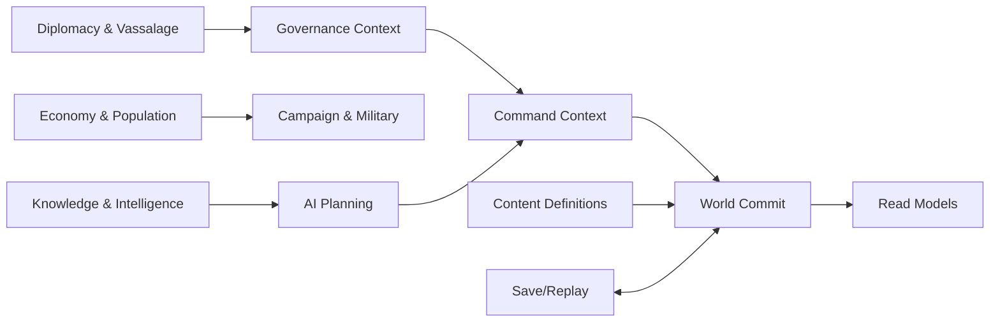

# 04. 软件架构设计

**状态：FROZEN**

## 1. 架构原则

1. **Functional Core, Imperative Shell**：规则尽可能是显式输入输出，平台和 IO 留在边界。
2. **单一权威写者**：只有模拟宿主可修改 WorldState。
3. **依赖向内**：表现和基础设施依赖领域，领域不依赖外部框架。
4. **协议显式**：线程、存档、内容和平台边界都有版本化 schema。
5. **可替换表现层**：地图或桌面壳可替换，不重写规则。
6. **可观测**：重要 AI 决策、命令拒绝和状态迁移可解释。
7. **先简单再证据优化**：不预先引入分布式、ECS、WASM 或复杂事件溯源。

## 2. Context Map



### 领域上下文

- World/Time：日历、地图、实体生命周期。
- Governance：宫廷、职务、代理人、行政容量、继承。
- EconomyPopulation：家庭、农业、市场、劳役、税收。
- DiplomacyVassalage：关系、义务、承诺、宣称、宗主链。
- CampaignMilitary：动员、行军、补给、围城、战斗。
- Knowledge：势力独立情报和估计。
- ProposalsEvents：家臣提案、叙事事件和玩家决策。
- AI：战略、战役、地方和战术规划。

上下文间通过公开 service/command/event 交互，不跨包读取私有表结构。

## 3. 包依赖

```text
sim-core
  ↑ sim-ai
  ↑ sim-testkit
  ↑ protocol
  ↑ save-format
  ↑ content-runtime

protocol + client-core
  ↑ ui
  ↑ map-renderer
  ↑ platform-browser
  ↑ platform-electron

apps/web        -> ui/map/client/platform-browser
apps/desktop    -> web build + platform-electron
apps/sim-runner -> sim-core/sim-ai/content/save
```

### 允许

- `sim-ai` 调用 `sim-core` 的查询和 Command builder。
- `client-core` 依赖 `protocol`，不依赖 sim-core 内部对象。
- `save-format` 通过明确定义的 DTO/codec 与 sim-core 集成。

### 禁止

- sim-core 导入任何 app、React、Pixi、Electron 或浏览器 API。
- UI 导入 WorldState 内部结构。
- map-renderer 调用领域服务。
- Electron main 读取或修改游戏状态。
- 内容源数据在运行时通过任意文件路径被直接执行。

## 4. 关键接口

### SimulationPort

```ts
interface SimulationPort {
  boot(input: BootInput): Promise<BootResult>;
  submit(command: GameCommand): Promise<CommandResult>;
  preview(command: GameCommand): Promise<CommandPreview>;
  query<T extends GameQuery>(query: T): Promise<QueryResult<T>>;
  setSpeed(speed: SimulationSpeed): Promise<void>;
  requestSave(): Promise<ArrayBuffer>;
  loadSave(bytes: ArrayBuffer): Promise<LoadResult>;
  subscribe(listener: SimulationListener): Unsubscribe;
}
```

浏览器实现使用 Worker；测试可使用 in-process adapter；两者必须通过 contract tests。

### PlatformAdapter

```ts
interface PlatformAdapter {
  readonly kind: 'browser' | 'electron';
  getLocale(): Promise<LocaleId>;
  loadSave(slot: SaveSlot): Promise<ArrayBuffer | null>;
  writeSave(slot: SaveSlot, data: ArrayBuffer): Promise<void>;
  exportSave(data: ArrayBuffer, suggestedName: string): Promise<void>;
  importSave(): Promise<ArrayBuffer | null>;
  setFullscreen(enabled: boolean): Promise<void>;
  openExternal(url: ApprovedExternalUrl): Promise<void>;
}
```

领域和 UI 不检测 `window.electron`，只接收 adapter。

## 5. 事务与提交

一个游戏日由多个阶段组成，但只有完整通过时才成为 Commit：

```text
WorldState before day N
→ execute phases in SimulationTransaction
→ validate invariants
→ swap committed state / increment revision
→ emit deltas
```

首版可以在同一可变状态上执行并使用受控 rollback/错误终止；长期不要求每步复制整个世界。任何阶段异常都必须记录系统、日、命令和 seed，不能向 UI 暴露半成品。

## 6. Read Model 架构

Read Models 是 UI 专用、可丢弃、可重建的派生状态：

- Worker 在 Commit 后生成增量。
- Client Store 合并增量并记录 revision。
- 若 revision 缺口、schema 不匹配或 context 恢复，客户端请求全量 snapshot。
- Read Model 可包含已格式化排序键，但不包含不可追溯的权威计算。

例：

```ts
interface CampaignPlannerReadModel {
  readonly revision: WorldRevision;
  readonly candidateTargets: readonly CampaignTargetSummary[];
  readonly routeOptions: readonly RoutePlanSummary[];
  readonly expectedSupplyDays: RangeInt;
  readonly readinessDate: GameDate;
  readonly blockers: readonly ReasonCode[];
}
```

## 7. 地图架构

### 数据分层

- Simulation Graph：节点/边、控制、距离、容量。
- Geographic Geometry：GeoJSON 编译后的 polygon/polyline/anchor。
- Render Cache：Pixi Mesh、texture、label LOD、hit-test index。

三者 ID 对齐但生命周期不同。

### 选取

首版：空间网格或 R-tree 候选 + 点在多边形内判断；城市/军队用屏幕空间索引。禁止为每个地区创建 DOM 或独立大型 collider。

## 8. 内容架构

### 源层

人类可编辑的 CSV/JSON/GeoJSON + research metadata。

### 编译层

CLI 负责 schema、引用、历史标签、地图、localization 和 ID 校验。

### 运行层

只读 pack + manifest。运行时不得根据显示名称推断 ID。

### 内容版本

内容 manifest hash 进入存档。允许兼容的文本/美术更新；改变实体/规则的内容更新需要迁移或拒绝加载并给出明确提示。

## 9. 事件 DSL

事件条件和效果使用白名单 AST：

```ts
type Condition =
  | { kind: 'and'; children: readonly Condition[] }
  | { kind: 'has-trait'; person: PersonRef; trait: TraitId }
  | { kind: 'relation-at-least'; a: PolityRef; b: PolityRef; value: Fixed }
  | { kind: 'date-range'; from: GameDate; to: GameDate };
```

- 禁止 `eval`、任意 JS 和文件访问。
- 编译器检测不可达条件、循环链和不存在引用。
- 复杂规则若无法安全表达，应进入代码并测试，不扩张 DSL 为通用编程语言。

## 10. AI 架构

AI 不持有第二套世界；只使用：

- 自身 `FactionKnowledgeState`。
- 公开规则查询。
- Candidate generators。
- Utility scorers。
- Command builders。

通过固定预算和脏标记调度，避免所有势力同日全量重算。规划缓存以世界 revision、知识 revision 和目标域为 key。

## 11. 存档架构

Codec 与状态模型分离，禁止直接 `JSON.stringify(WorldState)` 作为永久格式。使用明确 DTO 和 migration pipeline：

```text
bytes
→ envelope/checksum
→ decode version DTO
→ migrate Vn → current
→ validate semantic invariants
→ hydrate WorldState
```

存档迁移必须纯函数化并有 golden files。任何无法迁移情况返回结构化原因，不删除原文件。

## 12. 错误模型

- 预期业务失败：`Result<T, DomainError>` 或 discriminated outcome。
- 外部输入错误：schema error，包含路径与代码。
- 程序不变量失败：立即中止当前提交，生成诊断包。
- UI 不显示原始堆栈；开发模式可查看 trace ID。
- 禁止用异常控制普通命令合法性。

## 13. 线程与并发

- WorldState 只存在 Worker/Runner 线程。
- 主线程只发消息和合并 delta。
- 内容 pack 启动后不可变，可在两侧各自加载或 transferable 传输。
- Electron main 不参与每日日志或模拟循环。
- 未来桌面优化可以引入额外 worker 处理离线分析，但不得共享可变 WorldState。

## 14. 安全与信任区

```text
Untrusted: imported saves, mods, content source, external URLs
Validated boundary: schema + size + checksum + semantic validation
Trusted: compiled content pack, hydrated save, internal protocol
Privileged: Electron main/preload filesystem and platform calls
```

导入文件限制大小、递归深度和压缩炸弹。preload 不接受任意路径，save slot 映射由 main 控制。

## 15. 可扩展点

刻意保留：

- PlatformAdapter（未来 macOS/Tauri）。
- SimulationPort（未来 WASM 或远程观战，不承诺）。
- ContentPack（剧本/DLC/数据 Mod）。
- BattleCommand provider（玩家或 Tactical AI）。
- Save migrations。

刻意不建立：

- 通用插件服务定位器。
- 任意脚本执行。
- 运行时动态类加载。
- 为未知未来设计的抽象层。
